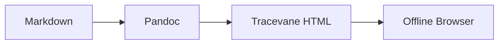

# Tracevane 离线渲染测试

这份文件用于覆盖 Tracevane Docs Renderer 的离线静态 HTML 能力。默认渲染应不依赖 CDN，并且可以直接打开生成的 HTML。

## Mermaid 图



## HTML Preview 隔离

```html-preview
<div style="padding: 16px; border: 1px solid #93c5fd; border-radius: 12px; background: #eff6ff; color: #1e3a8a;">
  <strong>Sandboxed preview</strong>
  <p>这段 HTML 应在 sandbox iframe 内预览，而不是直接注入主文档。</p>
  <script>document.body.dataset.shouldNotRun = 'true';</script>
</div>
```

## Chart Preview

```chart
{"title":"离线覆盖项","labels":["Mermaid","HTML","Chart","Code"],"series":[{"name":"Count","data":[1,1,1,1]}]}
```

## 代码块

```ts
export function renderOffline(input: string): string {
  return `offline:${input}`;
}
```

## 表格与链接

| 能力 | 预期 |
| --- | --- |
| Mermaid | 本地 bundle 渲染 |
| HTML Preview | sandbox iframe |
| Chart | 内置 SVG |
| Table | 可复制 CSV |

参见 [Renderer capabilities](renderer-capabilities.md)。


## 图片灯箱


