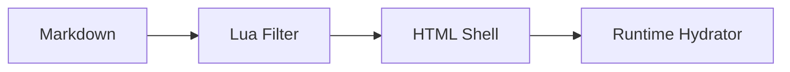

# Renderer Capabilities Fixture

This fixture validates the Tracevane Docs Renderer core reading experience.

## Table of contents follow scroll

Long section A.

### Nested section A1

More content for observer activation.

### Nested section A2

More content for observer activation.

## Code block

```ts
export const fixture = {
  renderer: "tracevane-docs",
  version: "v0.1",
};
```

## Mermaid block



## Table block

| Column | Value |
| --- | --- |
| renderer | tracevane-docs |
| mode | standalone |

## External link

[Tracevane](https://example.com)

## 站内引用关系

这个能力页会反向引用 [离线渲染测试](offline-rendering-test.md)，用于验证静态 Link Graph 能同时展示出链和入链。
