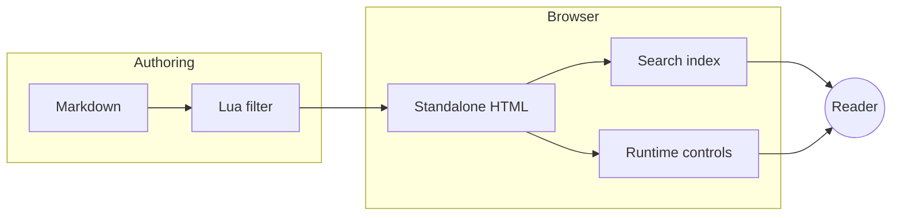
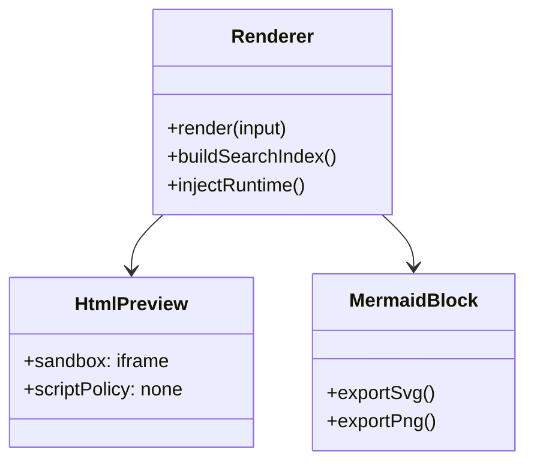
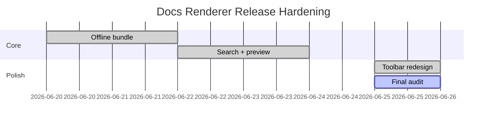

# Renderer Edge Cases and Safety Examples

这份文档专门覆盖边界场景：普通 HTML 源码、显式 HTML Preview、脚本被阻止、更多 Mermaid 图形、Chart 错误兜底、宽内容与离线发布说明。它用于防止后续优化把“安全预览”和“执行型 Demo”混在一起。

## HTML 语义判定

### 普通 `html` 代码块：只显示源码，不渲染 DOM

下面的代码块必须被当成源码。`#plain-html-should-not-render` 不应该成为主文档里的真实元素。

```html
<div id="plain-html-should-not-render" onclick="window.__TRACEVANE_PLAIN_HTML_EXECUTED = true">
  This is source code only.
</div>
<script>window.__TRACEVANE_PLAIN_HTML_SCRIPT = true</script>
```

### 显式 `html-preview`：静态 sandbox iframe 预览

只有 `html-preview` 才会渲染到 iframe。它适合展示静态 HTML/CSS 卡片、布局和响应式片段。

```html-preview
<section style="display:grid;gap:10px;padding:12px;border-radius:18px;background:linear-gradient(135deg,#ecfeff,#eef2ff);color:#0f172a;">
  <h2 style="margin:0;font-size:22px;">Static HTML Preview</h2>
  <p style="margin:0;color:#475569;">This block is rendered in a sandboxed iframe and can auto-size with content.</p>
  <div style="display:grid;grid-template-columns:repeat(auto-fit,minmax(120px,1fr));gap:8px;">
    <span style="padding:10px;border-radius:12px;background:#fff;border:1px solid #cbd5e1;">Card A</span>
    <span style="padding:10px;border-radius:12px;background:#fff;border:1px solid #cbd5e1;">Card B</span>
    <span style="padding:10px;border-radius:12px;background:#fff;border:1px solid #cbd5e1;">Card C</span>
  </div>
</section>
```

### 带脚本的 HTML Preview：脚本必须不执行

这个例子故意包含脚本和事件属性。预期结果：文本能显示，`window.__TRACEVANE_DYNAMIC_SCRIPT_RAN` 不存在，主页面也不被污染。

```html-preview
<div id="dynamic-script-probe" style="padding:14px;border-radius:14px;background:#fff7ed;border:1px solid #fed7aa;color:#9a3412;">
  <strong>Script execution probe</strong>
  <p id="script-status">script blocked by sandbox + iframe CSP</p>
  
  <script>
    window.__TRACEVANE_DYNAMIC_SCRIPT_RAN = true;
    document.getElementById('script-status').textContent = 'script unexpectedly ran';
  </script>
</div>
```

::: warning
动态 HTML / 带脚本 Demo 不能复用 `html-preview`。如果未来确实需要，需要新增显式语法（例如 `html-live`），并使用更强隔离、运行按钮、独立 CSP 与可审计权限提示。
:::

## Mermaid 更多图形

### Flowchart with subgraph



### Class diagram



### Gantt



## Chart 边界

### 右对齐图表

```chart
{"title":"Alignment Example","type":"bar","align":"right","labels":["Left","Center","Right"],"series":[{"name":"Coverage","data":[60,82,95]}]}
```

### JSON 错误兜底

```chart
{"title":"Broken chart","labels":["A","B"],"series":[{"name":"bad","data":[1,2,]}]}
```

## 宽内容压力测试

| 场景 | 期望行为 | 证明方式 | 风险 |
| --- | --- | --- | --- |
| Very long inline text `aaaaaaaaaaaaaaaaaaaaaaaaaaaaaaaaaaaaaaaaaaaaaaaaaaaaaaaaaaaaaaaaaaaaaaaaaaaaaaaa` | 不撑破页面 | 正文自动换行，表格横向滚动 | 小屏幕可读性 |
| HTML Preview long content | 非全屏自适应高度 | iframe 高度接近内容高度，无内层滚动条 | 动态内容可能异步变化 |
| Mermaid wide diagram | 默认不强行居中 | 作者可通过源码/配置表达布局 | 极宽图需要全屏查看 |
| Table copy | 悬浮工具栏不占位 | hover/focus 后显示在正文外侧或块外侧 | 窄屏使用 viewport rail |

## 离线发布核对清单

- 使用默认 `--mermaid-mode local`，包含 Mermaid 的页面会内嵌本地 bundle。
- 没有 Mermaid 的页面不嵌入 Mermaid bundle，减少体积。
- 搜索索引以内联 JSON 方式嵌入，不依赖外部服务。
- HTML Preview 不执行脚本，也不请求远程脚本。
- 若需要更小文件且允许联网，可显式选择 `--mermaid-mode cdn`。
- 若发布环境完全禁止大型内联脚本，可选择 `--mermaid-mode disabled`，保留源码而不渲染 Mermaid。

## SiYuan-inspired Mindmap Render

```mindmap
SiYuan-inspired renderer
  Explicit subtype dispatch
    mermaid
    chart
    mindmap
  Static safety boundary
    no script execution
    source remains inspectable
  Reader controls
    copy source
    export svg
    fullscreen canvas
```
