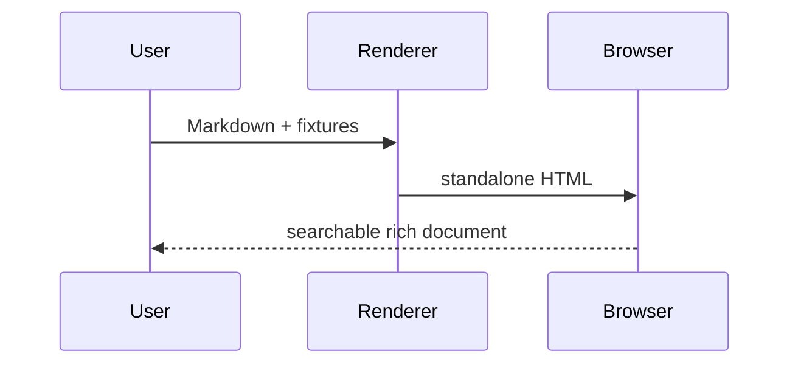
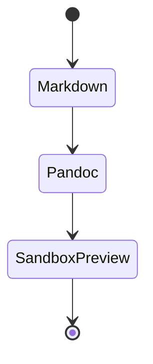
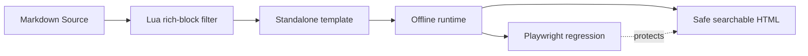
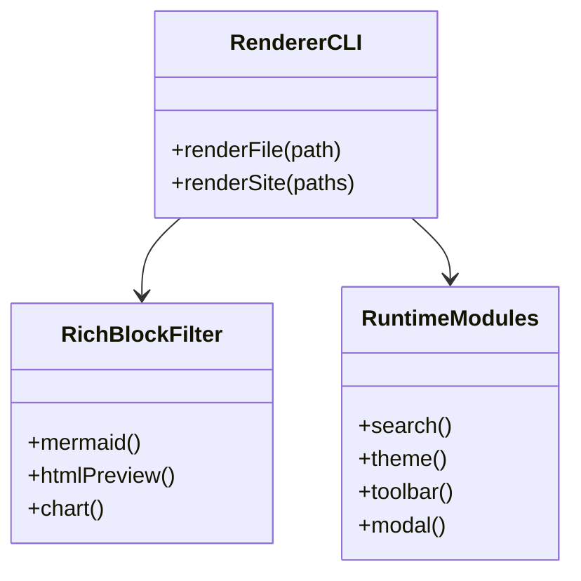
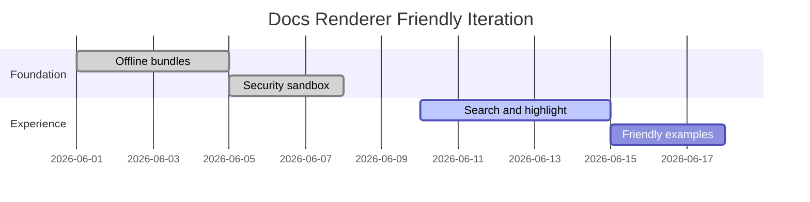
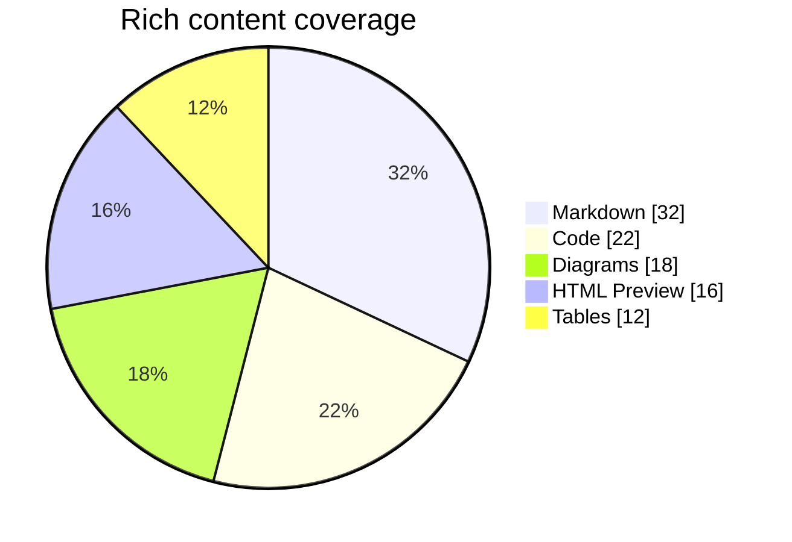
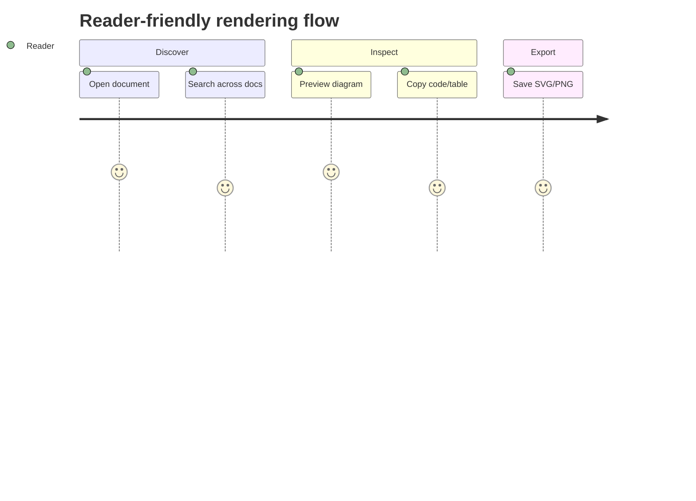
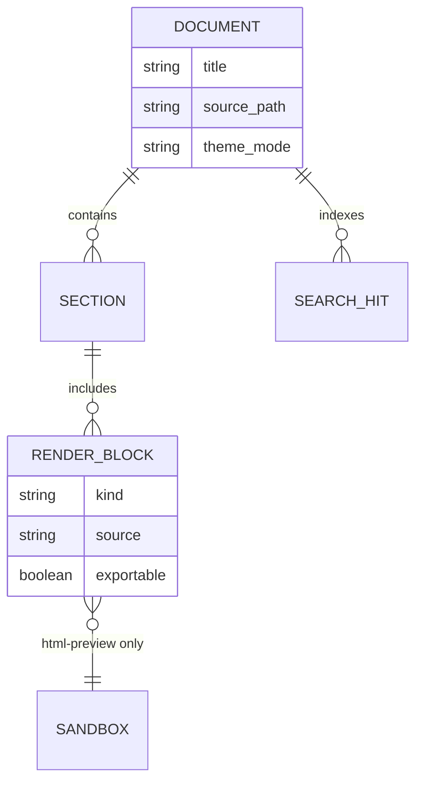

# Rich Rendering Gallery

这份示例用于展示 Tracevane Docs Renderer 的多类型内容渲染能力：告示块、任务列表、定义列表、脚注、代码高亮、Mermaid、多系列图表、长 HTML Preview、图片灯箱和响应式表格。

## 文本排版

普通段落支持 **strong**、_emphasis_、`inline code`、~~deleted text~~、<kbd>Ctrl</kbd> + <kbd>K</kbd>、缩写 HTML 以及脚注引用。[^gallery-note]

> 这是一级引用。
>
> > 这是嵌套引用，用来验证深浅色下的层次感。

---

## Callout 告示块

::: note
**Note**：这是普通提示块，用于说明背景信息。
:::

::: tip
**Tip**：这是最佳实践提示块。它应该和正文融合，但比普通段落更醒目。
:::

::: warning
**Warning**：这是风险提示。用于放置“注意、限制、迁移风险”等信息。
:::

::: danger
**Danger**：这是危险提示。不要把未审查第三方 HTML 作为主文档 DOM 注入。
:::

## 列表、任务与定义

- 支持普通列表
  - 支持嵌套层级
  - 支持较长内容自动换行，避免侧栏或正文横向溢出
- 支持任务列表
  - [x] 离线 Mermaid bundle
  - [x] HTML Preview sandbox
  - [x] 多文档搜索
  - [ ] 后续显式 `html-live` 动态沙箱

Renderer
: 将 Markdown、Lua filter、模板与内联 runtime 合成静态 HTML。

Security boundary
: 主文档默认不执行作者 HTML；HTML Preview 在 sandbox iframe 中静态预览。

## 多语言代码高亮

```json
{
  "renderer": "tracevane-docs",
  "offline": true,
  "features": ["search", "mermaid", "html-preview", "charts"]
}
```

```python
def render_document(path: str) -> str:
    if not path.endswith(".md"):
        raise ValueError("markdown only")
    return f"rendered:{path}"
```

```bash
python3 tools/docs-renderer/render-docs.py tools/docs-renderer/renderer/fixtures \
  --out .tmp/docs-renderer-preview-site \
  --clean --site-title "Tracevane Fixture Site"
```


```css
.tracevane-card {
  display: grid;
  gap: 12px;
  padding: 16px;
  color: var(--doc-ink);
  background: linear-gradient(135deg, #0f766e, #2563eb);
}
```

```sql
select provider, count(*) as requests
from gateway_usage
where created_at >= '2026-06-01'
group by provider
order by requests desc;
```

```yaml
renderer:
  offline: true
  theme: auto
  features:
    - mermaid-svg-export
    - table-copy
    - extended-code-highlight
```

```diff
@@ docs renderer @@
- fixed height html preview
+ dynamic height html preview
+ svg export for mermaid
```

```typescript
type RenderBlock = "markdown" | "code" | "mermaid" | "html-preview" | "chart" | "mindmap";

interface RenderPolicy {
  block: RenderBlock;
  offline: boolean;
  executable: false;
  searchableText: string[];
}

const htmlPreviewPolicy: RenderPolicy = {
  block: "html-preview",
  offline: true,
  executable: false,
  searchableText: ["iframe body", "source"],
};
```

### 更多语言与配置示例

```dockerfile
FROM python:3.12-slim
WORKDIR /app
COPY tools/docs-renderer ./tools/docs-renderer
RUN python -m pip install --no-cache-dir playwright
CMD ["python3", "tools/docs-renderer/render-docs.py", "tools/docs-renderer/renderer/fixtures"]
```

```toml
[docs.renderer]
offline = true
search = "multi-document"
html_preview = "sandboxed"

[docs.renderer.viewport]
mobile = 390
tablet = 768
desktop = 1280
```

```css
.rich-card {
  container-type: inline-size;
  color-scheme: light dark;
}

@container (max-width: 560px) {
  .rich-card__grid { grid-template-columns: 1fr; }
}
```

```markdown
::: tip
渲染示例本身也会进入搜索索引。
:::


| 能力 | 状态 |
| --- | --- |
| HTML Preview | sandbox |
| Mermaid | offline |
```


## Mermaid 多图类型

### Sequence



### State



### Flowchart：安全渲染管线



### Class Diagram：渲染器模块边界



### Gantt：发布节奏



### Pie：内容类型占比



### Journey：读者路径



### ER Diagram：文档对象关系



## Chart 多系列渲染

### 分组柱状图

```chart
{"title":"功能覆盖矩阵","type":"bar","labels":["Search","Mermaid","HTML","Chart","Table"],"series":[{"name":"Before","data":[1,1,0,1,1]},{"name":"After","data":[3,3,3,2,2]}]}
```

### 折线图

```chart
{"title":"迭代质量趋势","type":"line","align":"center","labels":["v1","v2","v3","v4"],"series":[{"name":"UX","data":[62,72,84,91]},{"name":"Safety","data":[58,75,88,94]},{"name":"Offline","data":[70,78,92,96]}]}
```

### 能力热力矩阵

```chart
{"title":"阅读体验评分","type":"bar","labels":["Typography","Search","Tables","Diagrams","HTML Preview","Print"],"series":[{"name":"Before","data":[58,74,66,62,55,68]},{"name":"Now","data":[88,92,86,84,90,82]}]}
```

## HTML Preview：长内容与响应式卡片

```html-preview
<section style="font-family: Inter, system-ui, sans-serif; color: #0f172a;">
  <style>
    .demo-grid { display: grid; grid-template-columns: repeat(auto-fit, minmax(160px, 1fr)); gap: 12px; }
    .demo-card { padding: 14px; border: 1px solid #cbd5e1; border-radius: 16px; background: linear-gradient(135deg,#ffffff,#eff6ff); }
    .demo-card strong { display: block; color: #0f766e; }
    @media (prefers-color-scheme: dark) {
      .demo-card { background: linear-gradient(135deg,#0f172a,#172554); border-color: #334155; color: #e5e7eb; }
      .demo-card strong { color: #5eead4; }
    }
  </style>
  <div class="demo-grid">
    <article class="demo-card"><strong>Mobile</strong><span>390px viewport preview</span></article>
    <article class="demo-card"><strong>Tablet</strong><span>768px viewport preview</span></article>
    <article class="demo-card"><strong>Desktop</strong><span>1280px viewport preview</span></article>
  </div>
  <p>这段 HTML 可以在全屏 Browser Viewer 中切换手机、平板、桌面和全宽预览。</p>
</section>
```

### 面向发布的 HTML Preview：状态卡片

```html-preview
<section style="font-family: Inter, system-ui, sans-serif; color: #0f172a;">
  <style>
    .status-shell { display: grid; gap: 14px; padding: 18px; border-radius: 22px; background: linear-gradient(135deg,#f8fafc,#eef2ff); border: 1px solid #cbd5e1; }
    .status-row { display: grid; grid-template-columns: repeat(3,minmax(0,1fr)); gap: 12px; }
    .status-card { padding: 14px; border-radius: 16px; background: rgba(255,255,255,.76); border: 1px solid rgba(148,163,184,.45); }
    .status-card b { display:block; font-size: 22px; color:#0f766e; }
    .status-card span { color:#475569; font-size: 13px; }
    @media (max-width: 640px) { .status-row { grid-template-columns: 1fr; } }
    @media (prefers-color-scheme: dark) {
      .status-shell { color:#e5e7eb; background: linear-gradient(135deg,#0f172a,#111827); border-color:#334155; }
      .status-card { background: rgba(15,23,42,.72); border-color:#334155; }
      .status-card b { color:#5eead4; }
      .status-card span { color:#cbd5e1; }
    }
  </style>
  <div class="status-shell">
    <strong>Renderer Release Readiness</strong>
    <div class="status-row">
      <article class="status-card"><b>100%</b><span>offline assets bundled</span></article>
      <article class="status-card"><b>15+</b><span>Playwright regressions</span></article>
      <article class="status-card"><b>0</b><span>script execution in preview</span></article>
    </div>
  </div>
</section>
```

### HTML Preview：产品说明卡与表单控件

```html-preview
<section style="font-family: Inter, system-ui, sans-serif; color: #0f172a;">
  <style>
    .product-demo { display:grid; grid-template-columns: 1.1fr .9fr; gap:16px; align-items:stretch; padding:18px; border-radius:24px; background:linear-gradient(135deg,#ecfeff,#f8fafc); border:1px solid #bae6fd; }
    .product-demo h3 { margin:0 0 8px; font-size:24px; }
    .product-demo p { margin:0; color:#475569; }
    .demo-form { display:grid; gap:10px; padding:14px; border-radius:18px; background:rgba(255,255,255,.72); border:1px solid rgba(14,165,233,.22); }
    .demo-form label { display:grid; gap:5px; font-size:12px; color:#334155; font-weight:700; }
    .demo-form input, .demo-form select { border:1px solid #cbd5e1; border-radius:10px; padding:9px 10px; background:white; color:#0f172a; }
    .demo-form button { border:0; border-radius:12px; padding:10px 12px; background:#0f766e; color:white; font-weight:800; }
    @media (max-width: 680px) { .product-demo { grid-template-columns:1fr; } }
    @media (prefers-color-scheme: dark) {
      .product-demo { color:#e7edf4; background:linear-gradient(135deg,#082f49,#0f172a); border-color:#075985; }
      .product-demo p, .demo-form label { color:#cbd5e1; }
      .demo-form { background:rgba(15,23,42,.72); border-color:#334155; }
      .demo-form input, .demo-form select { background:#0f172a; border-color:#334155; color:#e7edf4; }
      .demo-form button { background:#14b8a6; color:#062820; }
    }
  </style>
  <div class="product-demo">
    <article>
      <h3>Tracevane Preview Kit</h3>
      <p>用于验证 HTML Preview 在移动、平板、桌面模式下是否保持自适应高度、可搜索文本和安全沙箱。</p>
    </article>
    <form class="demo-form" action="#">
      <label>预览模式<input value="safe sandbox" readonly></label>
      <label>Viewport<select><option>Mobile 390</option><option>Tablet 768</option><option>Desktop 1280</option></select></label>
      <button type="button">不会提交</button>
    </form>
  </div>
</section>
```

### HTML Preview：脚本被阻止的友好提示

```html-preview
<section style="font-family: Inter, system-ui, sans-serif; padding:16px; border-radius:18px; background:#fff7ed; color:#7c2d12;">
  <strong>安全验证：</strong>这个预览包含 script 标签，但 sandbox + CSP 会阻止执行。
  <p id="friendly-script-status">script blocked by design</p>
  <script>document.getElementById('friendly-script-status').textContent = 'script unexpectedly executed';</script>
</section>
```

### 长内容 HTML Preview：自适应高度

```html-preview
<div style="display:grid;gap:12px;padding:4px;">
  <p style="margin:0 0 6px;color:#475569;">这个 HTML Preview 故意超过 1200px，用于验证内联 iframe 会按内容高度完整展开，而不是被固定容器截断。</p>
  <div style="height:135px;border-radius:14px;background:#ccfbf1;display:grid;place-items:center;color:#115e59;font-weight:700;">Long adaptive block 1</div>
  <div style="height:160px;border-radius:14px;background:#dbeafe;display:grid;place-items:center;color:#1e3a8a;font-weight:700;">Long adaptive block 2</div>
  <div style="height:185px;border-radius:14px;background:#fef3c7;display:grid;place-items:center;color:#92400e;font-weight:700;">Long adaptive block 3</div>
  <div style="height:110px;border-radius:14px;background:#fce7f3;display:grid;place-items:center;color:#9d174d;font-weight:700;">Long adaptive block 4</div>
  <div style="height:135px;border-radius:14px;background:#ede9fe;display:grid;place-items:center;color:#5b21b6;font-weight:700;">Long adaptive block 5</div>
  <div style="height:160px;border-radius:14px;background:#dcfce7;display:grid;place-items:center;color:#166534;font-weight:700;">Long adaptive block 6</div>
  <div style="height:185px;border-radius:14px;background:#fee2e2;display:grid;place-items:center;color:#991b1b;font-weight:700;">Long adaptive block 7</div>
  <div style="height:110px;border-radius:14px;background:#e0f2fe;display:grid;place-items:center;color:#075985;font-weight:700;">Long adaptive block 8</div>
  <div style="height:135px;border-radius:14px;background:#f3e8ff;display:grid;place-items:center;color:#6b21a8;font-weight:700;">Long adaptive block 9</div>
  <div style="height:160px;border-radius:14px;background:#ecfccb;display:grid;place-items:center;color:#3f6212;font-weight:700;">Long adaptive block 10</div>
</div>
```

### HTML Preview：响应式时间线

```html-preview
<section style="font-family:Inter,system-ui,sans-serif;color:#172033;container-type:inline-size;">
  <style>
    .timeline-demo { display:grid; gap:12px; padding:16px; border-radius:22px; background:linear-gradient(135deg,#f8fafc,#eef2ff); }
    .timeline-demo h3 { margin:0; font-size:22px; }
    .timeline-demo ol { list-style:none; display:grid; grid-template-columns:repeat(3,minmax(0,1fr)); gap:10px; padding:0; margin:0; }
    .timeline-demo li { padding:13px; border-radius:16px; background:rgba(255,255,255,.78); border:1px solid rgba(99,102,241,.18); }
    .timeline-demo b { display:block; color:#4f46e5; margin-bottom:4px; }
    .timeline-demo span { color:#475569; font-size:13px; line-height:1.45; }
    @container (max-width: 560px) { .timeline-demo ol { grid-template-columns:1fr; } }
    @media (prefers-color-scheme: dark) {
      .timeline-demo { color:#e5eefb; background:linear-gradient(135deg,#111827,#1e1b4b); }
      .timeline-demo li { background:rgba(15,23,42,.78); border-color:rgba(129,140,248,.28); }
      .timeline-demo b { color:#a5b4fc; }
      .timeline-demo span { color:#cbd5e1; }
    }
  </style>
  <div class="timeline-demo">
    <h3>渲染发布节奏</h3>
    <ol>
      <li><b>1. Author</b><span>Markdown、Mermaid、Chart、HTML Preview 同源编写。</span></li>
      <li><b>2. Verify</b><span>离线渲染、搜索、主题、导出和安全回归一起执行。</span></li>
      <li><b>3. Publish</b><span>输出自包含 HTML，适合本地预览或静态托管。</span></li>
    </ol>
  </div>
</section>
```

## 表格与宽内容

| 模块 | 默认行为 | 全屏能力 | 安全边界 | 复制/导出 | 搜索覆盖 | 备注 |
| --- | --- | --- | --- | --- | --- | --- |
| Mermaid | 本地 bundle 渲染 | 无限画布缩放/拖动 | Mermaid strict security level | SVG / PNG / 源码 | 图源码与标题 | 适合架构图和状态图 |
| HTML Preview | iframe 静态预览 | Browser viewer + viewport 切换 | sandbox + iframe CSP | 源码 / 视口信息 | iframe 渲染文本 + 源码 | 用于安全展示 HTML 片段 |
| Chart | 内置 SVG | 无限画布缩放/拖动 | JSON 解析 + escape | SVG / PNG / JSON | 数据源码 | 默认左对齐，作者可配置居中 |
| Table | 响应式横向滚动 | 全屏表格查看 | 文本复制为 CSV / Markdown | Markdown / CSV | 单元格文本 | 横向滚动提示不占正文流 |
| Code | 轻量语法高亮 | 源码弹层 | 复制纯文本 | 全部 / 选区 | 高亮后的代码文本 | 自动换行状态持久化 |

## 图片灯箱

"/><circle cx="220" cy="210" r="94" fill="white" opacity="0.24"/><text x="92" y="340" fill="white" font-size="42" font-family="Arial" font-weight="700">Image Lightbox</text></svg>)

[^gallery-note]: 脚注会出现在文档底部，并参与普通文本渲染与搜索。

## Mindmap 思维导图渲染

这个能力借鉴思源 Protyle 的 `data-subtype` 多渲染分发思想：作者用显式 fence 声明类型，运行时把源码转换为 SVG，并提供源码、导出和全屏浏览。

```mindmap
Docs Renderer
  Static pipeline
    Markdown input
    Pandoc AST
    Lua filter
  Rich renderers
    Mermaid
    HTML Preview
    Chart
    Mindmap
  Safety
    Inert HTML source
    Sandbox iframe
    CSP
  Verification
    Playwright suite
    Smoke render
    Completion audit
```

## Block Reference 块引用预览

像思源笔记一样，正文里的同页块引用应当可以快速预览目标块，而不需要先跳走。试试悬停这个引用：[查看 Mindmap 思维导图渲染](#mindmap-思维导图渲染)，或者跳到 [HTML Preview：长内容与响应式卡片](#html-preview长内容与响应式卡片)。

块引用预览是只读增强：它不会创建动态数据库，也不会执行目标块内的 HTML，只读取当前页面已渲染出的标题和摘要文本。

## Inline Memo 行内备注

思源的 inline memo 很适合做轻量旁注。这里的 [安全边界]{.inline-memo memo="普通 html 代码块保持源码；html-preview 只在 sandbox iframe 静态预览；动态脚本默认不执行。"} 可以 hover 或键盘聚焦查看说明，而且打印时会自动展开成括号备注。
